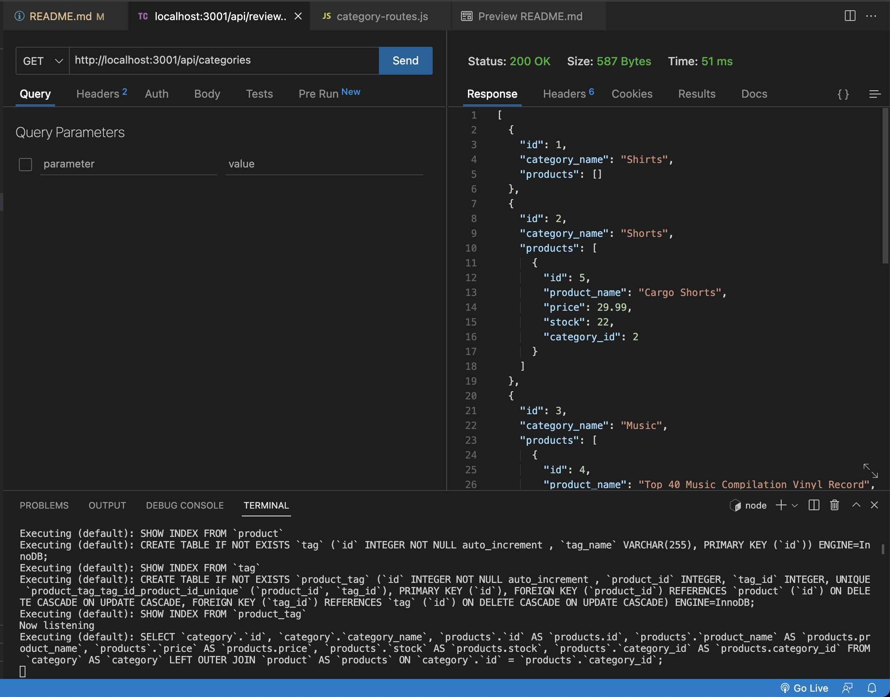
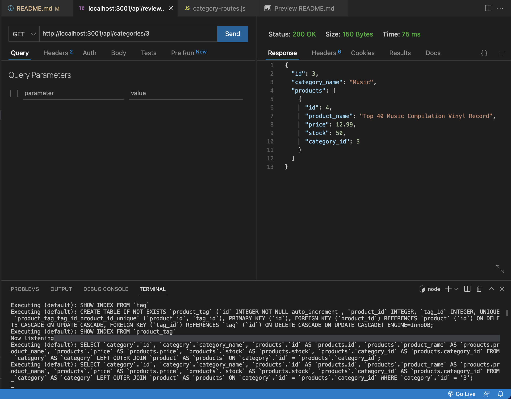
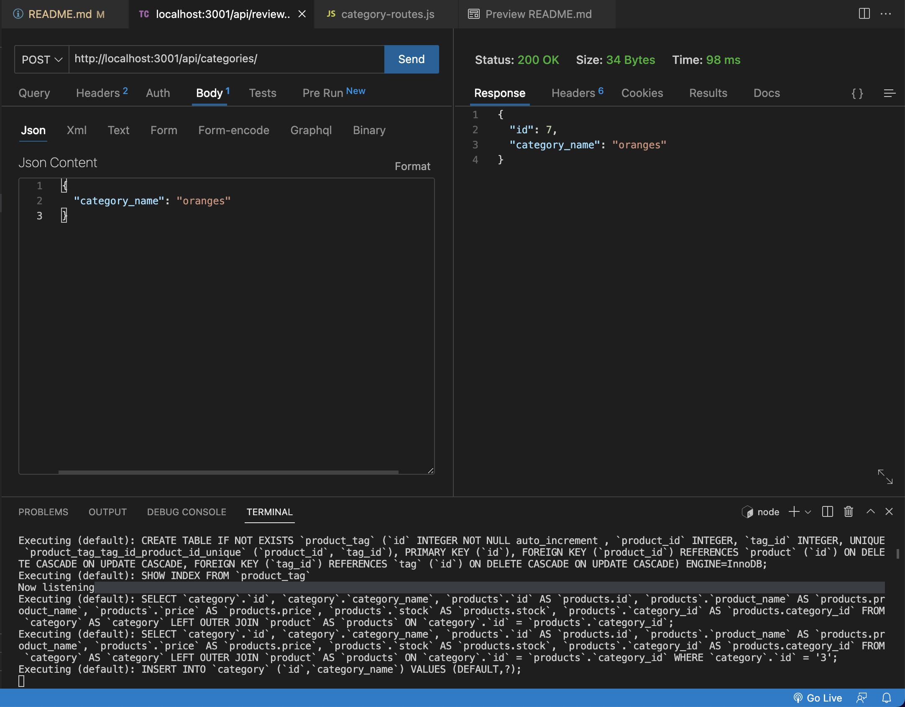
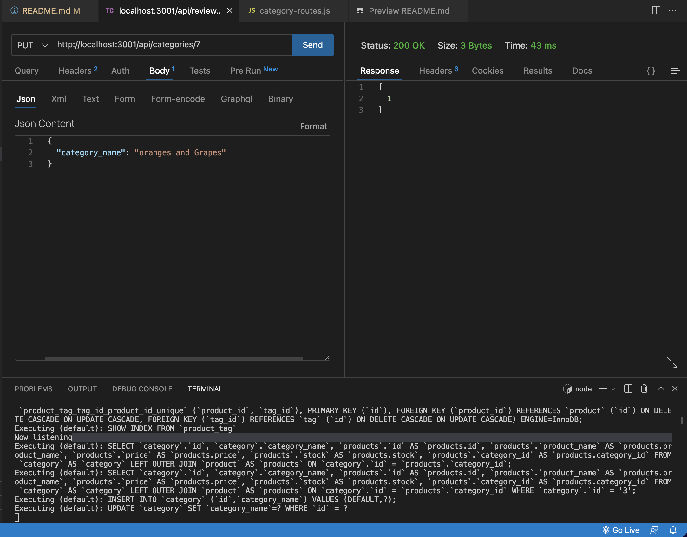
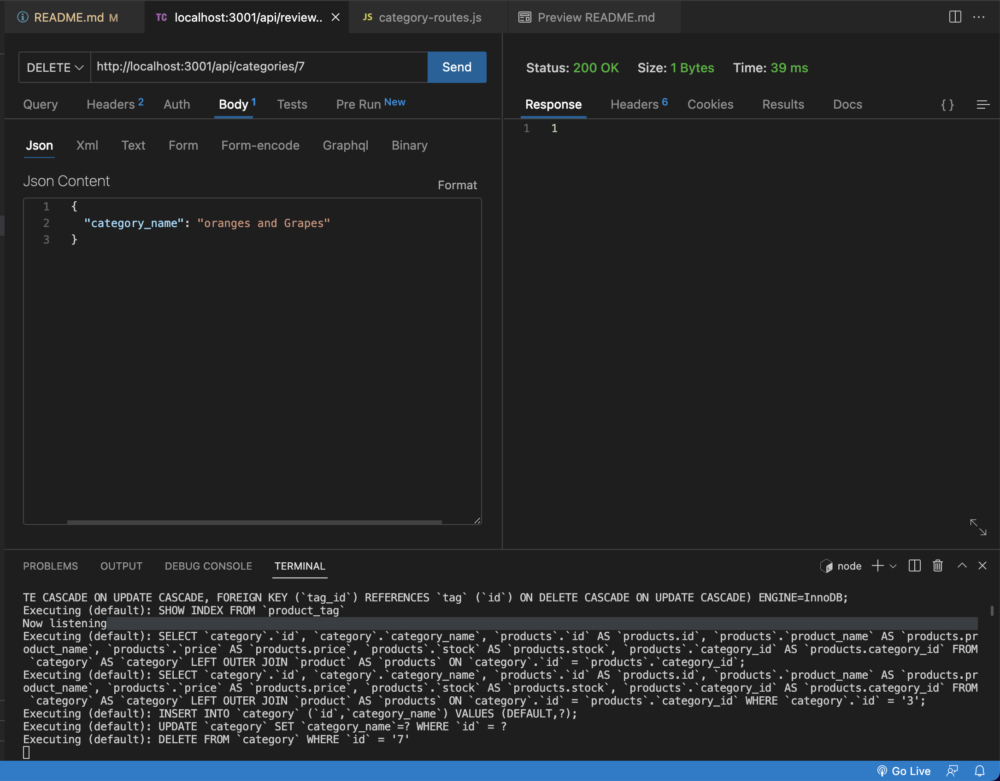

# 13 Object-Relational Mapping (ORM): E-Commerce Back End

## User Story

```md
AS A bootcamp student
I WANT to create a back end for an e-commerce website that uses the latest web technologies
SO THAT any company can compete with other other e-commerce copmanies
```

## Acceptance Criteria

```md
GIVEN a functional Express.js API

WHEN I add my database name, MySQL username, and MySQL password to an environment variable file
THEN I am able to connect to a database using Sequelizef

WHEN I enter schema to the DBMS and run the seed commands
THEN a development database is created and is seeded with test data

WHEN I enter the command 'npm start' to invoke the application
THEN my server is started and the Sequelize models are synced to the MySQL database

WHEN I open API GET routes in Thunderclient for categories, products, or tags
THEN the data for each of these routes is displayed in a formatted JSON

WHEN I open API POST routes in Thunderclient for categories, products, or tags
THEN I am able to successfully create data in my database

WHEN I open API PUT routes in Thunderclient for categories, products, or tags
THEN I am able to successfully update data in my database

WHEN I open API DELETE routes in Thunderclient for categories, products, or tags
THEN I am able to successfully delete data in my database
```

## Screenshots
### GET ROUTE



### GET ID ROUTE



### POST ROUTE



### PUT ROUTE



### DELETE ROUTE


## Links
Video: https://watch.screencastify.com/v/OXPL9JwIErTiZ9HVQdRN

GitHub Repo: https://github.com/edgarmartinez1212/e-commerce
